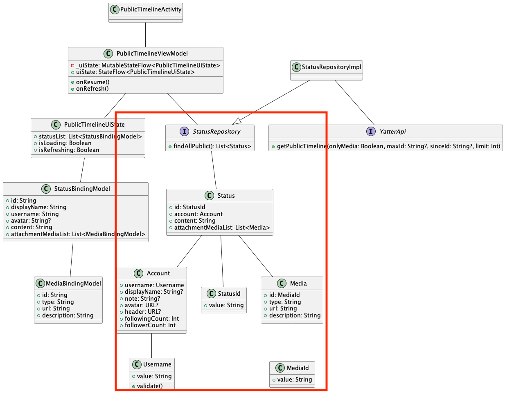

# パブリックタイムライン画面のdomain層実装
パブリックタイムライン画面のdomain層の実装を行います。  

クラス図の次の部分に当たります。  



## ドメイン層の説明
設計方針にもあるように、domain層では言語化された事業ドメインをそのままコードに落とし込むことに専念します。  

domain層には、次のクラスを定義します。  
- Entity
- Value Object
- Domain Service
- Repository

それぞれの詳細は[アーキテクチャドキュメント](../../../tutorial/アーキテクチャについて/architecture.md)でも解説されていますのでそちらをご確認ください。  

ここでは、軽い特徴のみに絞って説明します。  

### Entity
Entityは同一性によって定義・識別されるオブジェクトです。  
idやそれに値するものをクラスに持たせて利用するケースがほとんどです。  

特にDMMのコードでは、`Identifier`と`Entity`を用いて定義することで、ある値による同一性担保を強制させています。  

### Value Object
Entityと違い、自身が持つ属性(メンバー変数)が全て一致することで同一のオブジェクトとして扱います。  

Kotlinで定義するときはdata classで定義し、全プロパティをvalで定義します。  

### Domain Service
EntityともValue Objectとも違い、振る舞いそのものをモデリングしたい場合に利用されます。  
Entityの振る舞いとしてもValue Objectの振る舞いとしても定義が難しい場合に定義します。  

### Repository
あるドメインに対してオブジェクトの永続化を行ったり永続化されたオブジェクトの検索窓口になったりします。  
EntityやValue Objectの集約を扱います。  

## ドメインの考え方と実装
パブリックタイムライン画面を実装する際に必要な概念を検討します。  
まずパブリックタイムライン画面でYweetを表示するためにYweetドメインをEntityで定義します。  

ドメインを実装する前に次のファイルを新規作成します。  
domainパッケージ(ディレクトリ)は作成されていないためパッケージの作成からしましょう。  

```
domain/Yweet.kt
domain/YweetId.kt
domain/User.kt
domain/Username.kt
```

### Yweetの実装
ファイルが作成できたら、`Yweet`と`YweetId`を実装します。  

```Kotlin
// Yweet.kt
class Yweet(
  id: YweetId, // 一意のID
  val user: User, // 投稿者を表すドメイン、現状エラーになるが許容
  val content: String, // 投稿内容
  val attachmentImageList: List<Image>, // 画像のリスト
) : Entity<YweetId>(id)
```

```Kotlin
// YweetId.kt
class YweetId(value: String): Identifier<String>(value)
```

同じユーザーが同じ内容を投稿することもあり得るため、idをドメインモデルで持ってYweetの一意性を表すためにEntityにしています。  
Yweetの一意性をidで表現するために`YweetId`クラスを`Identifier`を継承して定義します。  
中身の値はただのStringですが、YweetIdとして定義することによりYweet以外のidやただの文字列がYweetのIdとして用いられることを防ぐことができます。  
定義した`YweetId`を`Entity`に渡すことにより、`Yweet`クラスを`YweetId`で一意性を表現したEntityとすることができます。  

### Userの実装

続いてUserドメインです。  
Yweetドメインですでに利用されている、投稿者を表すためのUserドメインも定義します。  
ユーザー名が空文字になることは許容されていないため、Usernameドメインに`validate`メソッドを作成しバリデーションチェックできるようにしておきます。  

```Kotlin
data class User(
  override val id: UserId,
  val username: Username, // ユーザー名
  val displayName: String?, // 表示名
  val note: String?, // ユーザーノート
  val avatar: URL, // アバター画像URL
  val header: URL, // ヘッダー画像URL
  val followingCount: Int, // フォロー数
  val followerCount: Int, // フォロワー数
) : Entity<UserId>(id)
```

```Kotlin
class UserId(value: String) : Identifier<String>(value)
```

```Kotlin
class Username(value: String): Identifier<String>(value) {
  fun validate(): Boolean = value.isNotBlank()
}
```

Userドメインでも同じ表示名やユーザー名を使う可能性があるため、一意性を担保するため今回のプロジェクトではidで同一性を担保します。  

### Repositoryの実装

ドメインモデルを作成したらRepositoryの定義をします。  
`YweetRepository`ファイルを`com.dmm.bootcamp.yatter2025.domain.repositroy`パッケージに作成します。  
Domain層では、Repositoryのinterface定義のみをするので、interfaceとして`domain/repository`配下に`YweetRepository`を作成します。  

```Kotlin
interface YweetRepository {
}
```

`YweetRepository`でYweetの取得や作成、削除といったメソッドを定義していきます。  

```Kotlin
interface YweetRepository {
  suspend fun findById(id: YweetId): Yweet?

  suspend fun findAllPublic(): List<Yweet>

  suspend fun findAllHome(): List<Yweet>

  suspend fun create(
    content: String,
    attachmentList: List<File>
  ): Yweet

  suspend fun delete(
    yweet: Yweet
  )
}
```

これでパブリックタイムライン画面で利用するdomain層の実装を行うことができました。  

# [次の資料](./2_infra層実装.md)
