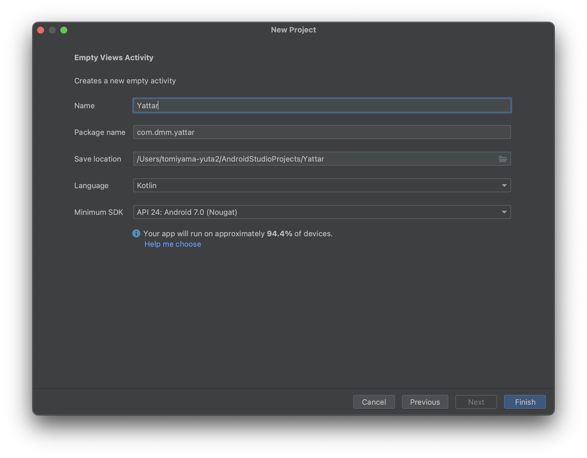
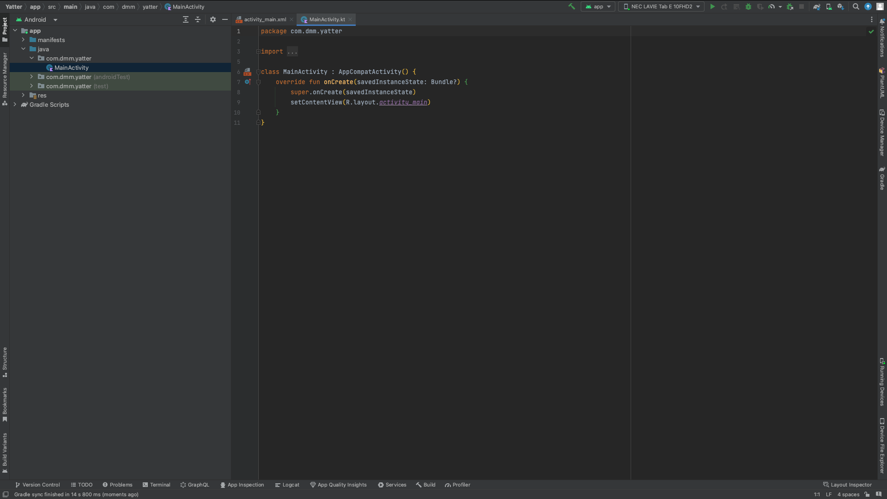

# はじめに
この資料では、Jetpack Composeでない、従来のAndroidアプリ開発の仕組みを使ってYatterの実装をしながら解説します。

こちらは必須ではありませんので、余裕のある人、もしくはAndroidアプリ開発について更に知りたいという人が見てもらえればと思います。

# プロジェクトのセットアップ

Android Studioの `File` -> `New` -> `New Project` から新しいプロジェクトを作ります。

今回は `Empty Views Activity` を選びます。

`Name` と `Package name` はなんでもいいのですが、既にJetpack Composeで実装しているほうのYatterのプロジェクトがある場合はそれにかぶらないようにしましょう。

`Finish` をクリックすればプロジェクトが作成されます。

