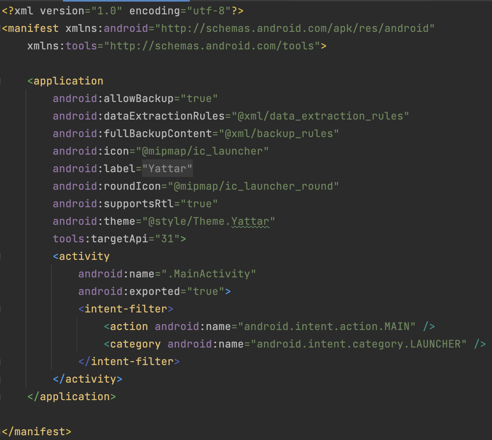

# Activityについて

Androidの最も重要なコンポーネントの1つに、 `Activity` があります。

多くのモバイルアプリは、複数の画面で構築されています。ActivityはJavaのclassとして提供され、それを継承することで1つの画面を実装します。

この図には2つの画面がありますが、それぞれに対応するActivityがあります。

Activityは基本的にはJava/KotlinのコードとXMLのレイアウトファイルをセットで扱います。Android StudioからActivityを新規作成すると、ActivityのKotlinファイルとレイアウトのXMLファイルが同時に生成されます。

追加したActivityは、アプリのマニフェストで宣言する必要があります。Android StudioからActivityを新規追加した場合は自動で `AndroidManifest.xml` が更新されるので今回は編集する必要はありませんが、手動でActivityを追加した場合は手動でActivityを宣言する必要があります。

